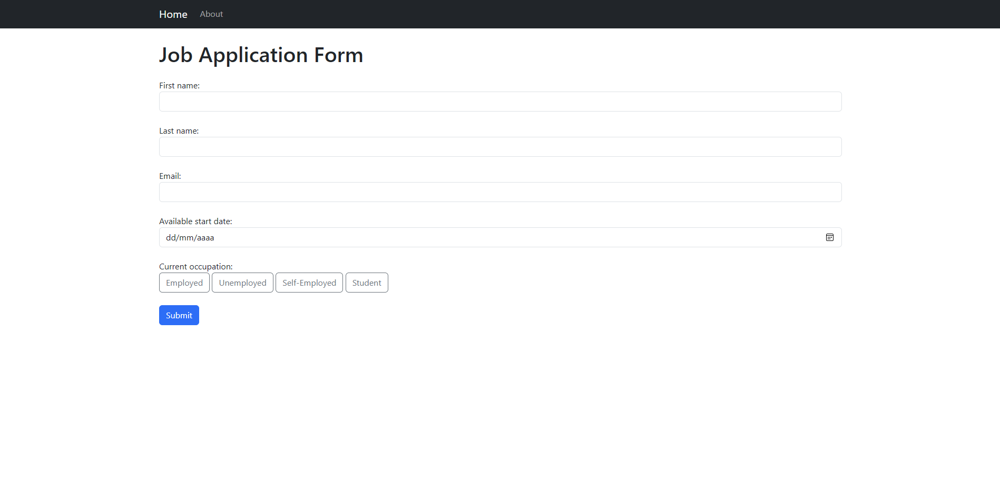
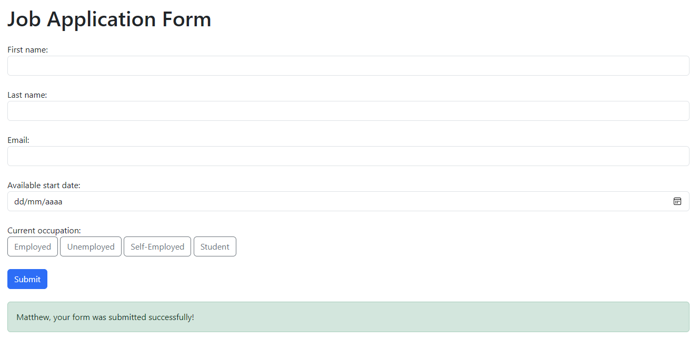
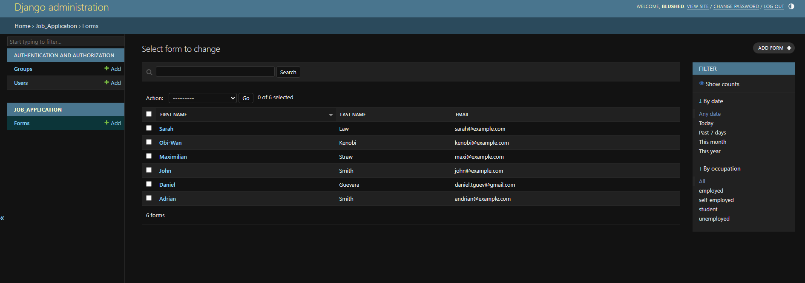
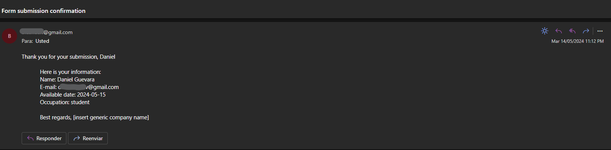

# Job application form (Django)

A basic Django web application that uses a form to collect job applications. An admin account can be used to access the sqlite database containing the user data using the Django admin interface. The user will furthermore receive an email confirming his application.

## Screenshots

* Home page (form)

* Djando admin interface

* Email confirmation

